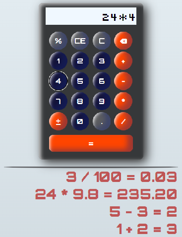

# Javascript_Apps

## Projects

Learning and practicing javascript concepts.

### [JSCalculator](./JSCalculator/)

Simple javascript calculator that calculates simple equations and keeps a short history.

---

### [WeatherAppJS](./WeatherAppJS/)

App that gives weather information using the OpenWeather API.
